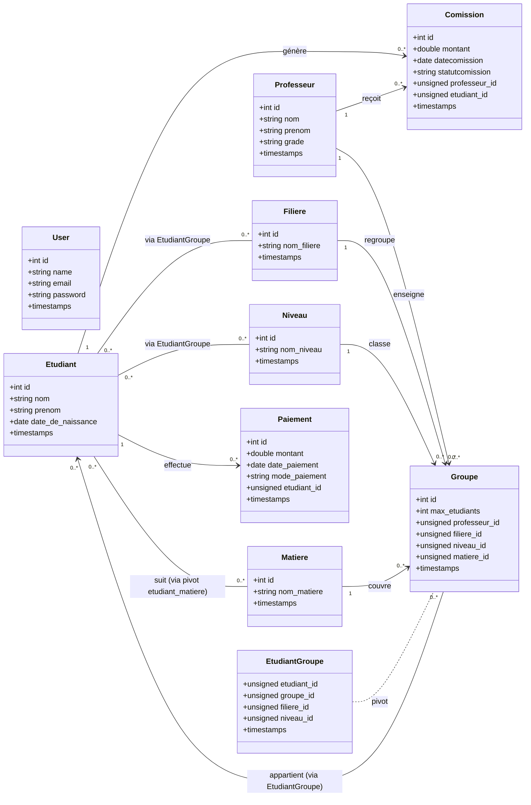

# Diagramme de classes

```mermaid
classDiagram
    direction LR

    class User {
        +int id
        +string name
        +string email
        +string password
        +timestamps
    }

    class Etudiant {
        +int id
        +string nom
        +string prenom
        +date date_de_naissance
        +timestamps
    }

    class Professeur {
        +int id
        +string nom
        +string prenom
        +string grade
        +timestamps
    }

    class Filiere {
        +int id
        +string nom_filiere
        +timestamps
    }

    class Matiere {
        +int id
        +string nom_matiere
        +timestamps
    }

    class Niveau {
        +int id
        +string nom_niveau
        +timestamps
    }

    class Groupe {
        +int id
        +int max_etudiants
        +unsigned professeur_id
        +unsigned filiere_id
        +unsigned niveau_id
        +unsigned matiere_id
        +timestamps
    }

    class Comission {
        +int id
        +double montant
        +date datecomission
        +string statutcomission
        +unsigned professeur_id
        +unsigned etudiant_id
        +timestamps
    }

    class Paiement {
        +int id
        +double montant
        +date date_paiement
        +string mode_paiement
        +unsigned etudiant_id
        +timestamps
    }

    class EtudiantGroupe {
        +unsigned etudiant_id
        +unsigned groupe_id
        +unsigned filiere_id
        +unsigned niveau_id
        +timestamps
    }

    %% Relations principales
    Professeur "1" --> "0..*" Groupe : enseigne
    Filiere "1" --> "0..*" Groupe : regroupe
    Niveau "1" --> "0..*" Groupe : classe
    Matiere "1" --> "0..*" Groupe : couvre

    Groupe "0..*" --> "0..*" Etudiant : appartient (via EtudiantGroupe)
    Etudiant "1" --> "0..*" Paiement : effectue
    Etudiant "1" --> "0..*" Comission : génère
    Professeur "1" --> "0..*" Comission : reçoit

    Etudiant "0..*" -- "0..*" Matiere : suit (via pivot etudiant_matiere)
    Etudiant "0..*" -- "0..*" Filiere : via EtudiantGroupe
    Etudiant "0..*" -- "0..*" Niveau : via EtudiantGroupe

    %% Table pivot matérialisée
    EtudiantGroupe .. Groupe : pivot
```

